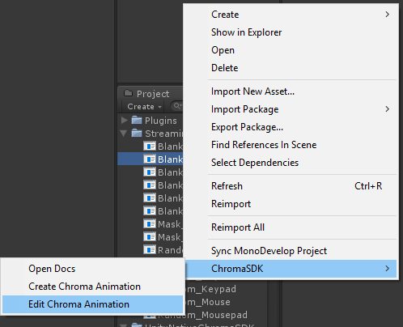
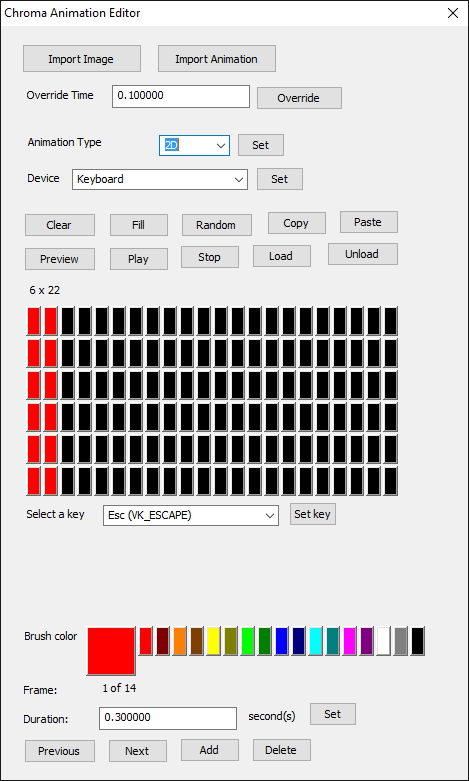

# UnityNativeChromaSDK - Unity native library for the ChromaSDK

**Table of Contents**

* [Related](#related)
* [Frameworks supported](#frameworks-supported)
* [Prerequisites](#prerequisites)
* [Dependencies](#dependencies)
* [Packaging](#packaging)
* [Getting Started](#getting-started)
* [Tutorials](#tutorials)
* [Assets](#assets)
* [API](#api)
* [Examples](#examples)

<a name="related"></a>
## Related

- [CChromaEditor](https://github.com/RazerOfficial/CChromaEditor) - C++ Native MFC Library for playing and editing Chroma animations

- [GameMakerChromaExtension](https://github.com/RazerOfficial/GameMakerChromaExtension) - GameMaker Extension to control lighting for Razer Chroma

- [UE4ChromaSDK](https://github.com/RazerOfficial/UE4ChromaSDK) - Unreal Engine 4 (UE4) Blueprint library to control lighting for Razer Chroma

- [UnityNativeChromaSDK](https://github.com/RazerOfficial/UnityNativeChromaSDK) - Unity native library for the ChromaSDK

- [UnityChromaSDK](https://github.com/RazerOfficial/UnityChromaSDK) - Unity C# library for the Chroma Rest API


<a name="frameworks-supported"></a>
## Frameworks supported
- Unity 3.5.7 or later
- Windows Editor / Windows Standalone


<a name="prerequisites"></a>
## Prerequisites
- Install [Synapse](http://developer.razerzone.com/works-with-chroma/download/)
- Install [Chroma SDK 2.5.3](http://developer.razerzone.com/works-with-chroma/download/)
- Install [Microsoft Visual C++ Redistributable for Visual Studio 2017](https://www.visualstudio.com/downloads/)


<a name="dependencies"></a>
## Dependencies
- [CChromaEditor](https://github.com/RazerOfficial/CChromaEditor) - C++ Native MFC Library for playing and editing Chroma animations

<a name="packaging"></a>
## Packaging

Import [UnityNativeChromaSDK.unitypackage](https://github.com/razerofficial/UnityNativeChromaSDK/releases/tag/1.0) into your project.

<a name="getting-started"></a>
## Getting Started

1 Install [Synapse](http://developer.razerzone.com/works-with-chroma/download/)

2 (Optional) Install the [Emulator](http://developer.razerzone.com/works-with-chroma/download/)

3 Connect [Razer Chroma hardware](http://developer.razerzone.com/works-with-chroma/compatible-devices/)

4 Install [Unity3d](https://unity3d.com/)

5 Open Unity and start with an existing project or open a new project

6 Backup your project in source control!

7 Import [UnityNativeChromaSDK.unitypackage](https://github.com/razerofficial/UnityNativeChromaSDK/releases/tag/1.0) into your project.

8 Create `Chroma` animations from the `Assets/ChromaSDK/Create Chroma Animation` menu item. This will open a file save dialog and create a chroma animation file when saved.

9 Edit `Chroma` animations by selecting a `Chroma` animation in the `Object Hierarchy` and select the `Assets/ChromaSDK/Edit Chroma Animation` menu item.


10 Also edit `Chroma` animations by selecting a `.chroma` file in the `Object Hierarchy`, right-click, and select the `ChromaSDK/Edit Chroma Animation` context item.




<a name="tutorials"></a>
## Tutorials

[Razer Chroma Playlist](https://www.youtube.com/playlist?list=PL4mjXeDqRBMRE19MjB8aiNPRnm_nYtct7)


**Capture Window**

<a target="_blank" href="https://www.youtube.com/watch?v=dUo0wYkh6oM"></a>


**Composite Capture**

<a target="_blank" href="https://www.youtube.com/watch?v=1m9Qzo6dEyE"></a>


**Composite Playback**

<a target="_blank" href="https://www.youtube.com/watch?v=PeQfVA6E_2M"></a>


**Capture With Images**

<a target="_blank" href="https://www.youtube.com/watch?v=6XKO6u7nWGk"></a>


**Keyboard Layout Toggle**

<a target="_blank" href="https://www.youtube.com/watch?v=48l0cO3mITk"></a>


**Loop and Reverse**

<a target="_blank" href="https://www.youtube.com/watch?v=jkcdqcBsGi0"></a>


**Keyboard Masks**

<a target="_blank" href="https://www.youtube.com/watch?v=gOegDh8tLUo"></a>


**Layouts and Playback Looping**

<a target="_blank" href="https://www.youtube.com/watch?v=J6BWRsBHzWo"></a>


<a name="assets"></a>
## Assets

`Chroma` animations are loaded from the [`StreamingAssets`](https://docs.unity3d.com/Manual/StreamingAssets.html) folder.

Use the `GameObject->ChromaSDK` menu to create `Chroma` animations.


`Chroma` animations should be saved in the [`StreamingAssets`](https://docs.unity3d.com/Manual/StreamingAssets.html) folder.

Editing `Chroma` animations will open the `Chroma` editor dialog.



<a name="api"></a>
## API

* [CloseAnimationName](#CloseAnimationName)
* [CopyKeysColorAllFramesName](#CopyKeysColorAllFramesName)
* [EditAnimation](#EditAnimation)
* [GetCurrentFrameName](#GetCurrentFrameName)
* [GetFrameCountName](#GetFrameCountName)
* [HasAnimationLoopName](#HasAnimationLoopName)
* [Init](#Init)
* [IsAnimationPausedName](#IsAnimationPausedName)
* [IsPlaying](#IsPlaying)
* [PauseAnimationName](#PauseAnimationName)
* [PlayAnimationName](#PlayAnimationName)
* [PlayComposite](#PlayComposite)
* [PluginIsInitialized](#PluginIsInitialized)
* [PluginIsPlatformSupported](#PluginIsPlatformSupported)
* [ResumeAnimationName](#ResumeAnimationName)
* [SetCurrentFrameName](#SetCurrentFrameName)
* [SetKeysColorAllFramesName](#SetKeysColorAllFramesName)
* [StopAnimationName](#StopAnimationName)
* [StopAnimationType](#StopAnimationType)
* [StopComposite](#StopComposite)
* [Uninit](#Uninit)


Add the `ChromaSDK` namespace.

```csharp
using ChromaSDK;
```

The `API` is only available on the `Windows Editor` and `Windows Standalone` platforms.

```charp
#if UNITY_EDITOR_WIN || UNITY_STANDALONE_WIN
// put your windows specific code in here
#endif
```


<a name="Init"></a>
**Init**

The native plugin should be initialized on `Awake`. `0` indicates success, otherwise failure.

```charp
private void Awake()
{
    UnityNativeChromaSDK.Init();
}
```


<a name="Uninit"></a>
**Uninit**

The native plugin should be uninitialized on `Quit`. `0` indicates success, otherwise failure.

```charp
private void OnApplicationQuit()
{
    UnityNativeChromaSDK.Uninit();
}
```


<a name="PluginIsInitialized"></a>
**PluginIsInitialized**

Returns true if the plugin has been initialized. Returns false if the plugin is uninitialized.

```charp
bool isInitialized = UnityNativeChromaSDK.PluginIsInitialized();
```


<a name="PlayAnimationName"></a>
**PlayAnimationName**

The animation will play with looping `ON` or `OFF`.

```charp
string animation = "Random_Keyboard.chroma";
bool loop = true;
UnityNativeChromaSDK.PlayAnimationName(animation, loop);
```


<a name="StopAnimationName"></a>
**StopAnimationName**

The animation will stop playing.

```charp
string animation = "Random_Keyboard.chroma";
UnityNativeChromaSDK.StopAnimationName(animation);
```


<a name="StopAnimationType"></a>
**StopAnimationType**

Stop playing animations by type.

```charp
UnityNativeChromaSDK.StopAnimationType(UnityNativeChromaSDK.Device.ChromaLink);
UnityNativeChromaSDK.StopAnimationType(UnityNativeChromaSDK.Device.Headset);
UnityNativeChromaSDK.StopAnimationType(UnityNativeChromaSDK.Device.Keyboard);
UnityNativeChromaSDK.StopAnimationType(UnityNativeChromaSDK.Device.Keypad);
UnityNativeChromaSDK.StopAnimationType(UnityNativeChromaSDK.Device.Mouse);
UnityNativeChromaSDK.StopAnimationType(UnityNativeChromaSDK.Device.Mousepad);
```


<a name="CloseAnimationName"></a>
**CloseAnimationName**

The animation will be closed so that it can be reloaded from disk.

```charp
string animation = "Random_Keyboard.chroma";
UnityNativeChromaSDK.CloseAnimationName(animation);
```


<a name="EditAnimation"></a>
**EditAnimation**

The animation will open in the editor dialog. Only one animation can be edited at a time.

```charp
string animation = "Random_Keyboard.chroma";
UnityNativeChromaSDK.EditAnimation(animation);
```


<a name="GetFrameCountName"></a>
**GetFrameCountName**

Get the frame count of the animation.

```charp
string animation = "Random_Keyboard.chroma";
int frameCount = UnityNativeChromaSDK.GetFrameCountName(animation);
```


<a name="CopyKeysColorAllFramesName"></a>
**CopyKeysColorAllFramesName**

Copy a set of key colors from the source animation to the target animation for all frames.

```charp
string sourceAnimation = "Fire_Keyboard.chroma";
string targetAnimation = "Random_Keyboard.chroma";
UnityNativeChromaSDK.CopyKeysColorAllFramesName(sourceAnimation, targetAnimation,
    new int[] {
        (int)UnityNativeChromaSDK.Keyboard.RZKEY.RZKEY_W,
        (int)UnityNativeChromaSDK.Keyboard.RZKEY.RZKEY_A,
        (int)UnityNativeChromaSDK.Keyboard.RZKEY.RZKEY_S,
        (int)UnityNativeChromaSDK.Keyboard.RZKEY.RZKEY_D,
        (int)UnityNativeChromaSDK.Keyboard.RZLED.RZLED_LOGO});
```


<a name="SetKeysColorAllFramesName"></a>
**SetKeysColorAllFramesName**

Assign a set of key colors to a static color for all animation frames.

```charp
string animation = "Random_Keyboard.chroma";
Color color = Color.red;
UnityNativeChromaSDK.SetKeysColorAllFramesName(animation,
    new int[] {
        (int)UnityNativeChromaSDK.Keyboard.RZKEY.RZKEY_I,
        (int)UnityNativeChromaSDK.Keyboard.RZKEY.RZKEY_J,
        (int)UnityNativeChromaSDK.Keyboard.RZKEY.RZKEY_K,
        (int)UnityNativeChromaSDK.Keyboard.RZKEY.RZKEY_L,
        (int)UnityNativeChromaSDK.Keyboard.RZKEY.RZKEY_ENTER},
    color);
```


<a name="GetCurrentFrameName"></a>
**GetCurrentFrameName**

Get the current frame of the animation.

```charp
string animation = "Random_Keyboard.chroma";
int currentFrame = UnityNativeChromaSDK.GetCurrentFrameName(animation)
```


<a name="SetCurrentFrameName"></a>
**SetCurrentFrameName**

Set the current frame of the animation.

```charp
string animation = "Random_Keyboard.chroma";
int frameId = 0;
UnityNativeChromaSDK.SetCurrentFrameName(animation, frameId);
```


<a name="IsAnimationPausedName"></a>
**IsAnimationPausedName**

Check if the animation is paused.

```charp
string animation = "Random_Keyboard.chroma";
bool isPaused = UnityNativeChromaSDK.IsAnimationPausedName(animation);
```


<a name="HasAnimationLoopName"></a>
**HasAnimationLoopName**

Check if the animation has loop `ON` or `OFF`.

```charp
string animation = "Random_Keyboard.chroma";
bool loop = UnityNativeChromaSDK.HasAnimationLoopName(animation);
```


<a name="PauseAnimationName"></a>
**PauseAnimationName**

Pause the animation.

```charp
string animation = "Random_Keyboard.chroma";
UnityNativeChromaSDK.PauseAnimationName(animation);
```


<a name="ResumeAnimationName"></a>
**ResumeAnimationName**

Resume playing the animation with loop `ON` or `OFF`.

```charp
string animation = "Random_Keyboard.chroma";
bool loop = true;
UnityNativeChromaSDK.ResumeAnimationName(animation, loop);
```


<a name="PlayComposite"></a>
**PlayComposite**

Play a set of animations with loop `ON` or `OFF`. A set includes ChromaLink, Headset, Keyboard, Keypad, Mouse, and Mousepad.

```charp
string composite = "Random";
bool loop = true;
UnityNativeChromaSDK.PlayComposite(composite, loop);
```


<a name="StopComposite"></a>
**StopComposite**

Stop playing a set of animations.

```charp
string composite = "Random";
UnityNativeChromaSDK.StopComposite(composite);
```


<a name="IsPlaying"></a>
**IsPlaying**

Check if an animation is playing.

```charp
string animation = "Random_Keyboard.chroma";
bool isPlaying = UnityNativeChromaSDK.IsPlaying(animation);
```


<a name="PluginIsPlatformSupported"></a>
**PluginIsPlatformSupported**

Check if the current platform supports playing Chroma.

```charp
bool isPlatformSupported = UnityNativeChromaSDK.PluginIsPlatformSupported();
```


<a name="examples"></a>
## Examples

**Example01**

[UnityNativeChromaSDKExample01.cs](Assets/UnityNativeChromaSDK/Examples/Scripts/UnityNativeChromaSDKExample01.cs) has a GUI example to play/stop/edit `Chroma` animations at runtime.
 
 

**Example02**

[UnityNativeChromaSDKExample02.cs](Assets/UnityNativeChromaSDK/Examples/Scripts/UnityNativeChromaSDKExample02.cs) has a GUI button to load scene 1 to show animations work with multiple scenes.


**UnityNativeChromaSDKPlayOnEnable**

The [UnityNativeChromaSDKPlayOnEnable.cs](Assets/UnityNativeChromaSDK/Scripts/UnityNativeChromaSDKPlayOnEnable.cs) script will automatically open and play a `Chroma` animation by name.

The `AnimationName` field references a `.chroma` asset `filename` from the [`StreamingAssets`](https://docs.unity3d.com/Manual/StreamingAssets.html) folder.

The `.chroma` extension on the `AnimationName` field is optional.

The `UnityNativeChromaSDKPlayOnEnable.cs` script will play the animation when the `OnEnable` event fires.
 
The `UnityNativeChromaSDKPlayOnEnable.cs` script will stop the animation when the `OnDisable` event fires.


**Example03**

Particle capture example

**Example04**

Show `PlayOnEnable` script

**Example05**

Image plane capture example

**Example06**

Show `PlayAndDeactivate` script

**Example07**

Show `PlayOnDestroy` script

**Example08**

`SetKeys` and `CopyKeys` can be used to highlight keys on top of an animated base layer.

**Example09**

Chroma animations can be paused and resumed with looping ON or OFF.
