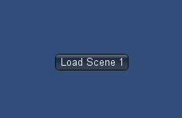
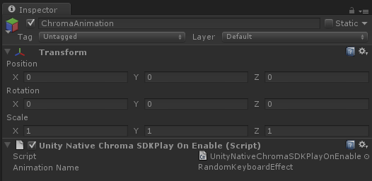

# UnityNativeChromaSDK - Unity native library for the ChromaSDK

**Table of Contents**

* [Related](#related)
* [Frameworks supported](#frameworks-supported)
* [Prerequisites](#prerequisites)
* [Dependencies](#dependencies)
* [Packaging](#packaging)
* [Getting Started](#getting-started)
* [Tutorials](#tutorials)
* [Assets](#assets)
* [API](#api)
* [Examples](#examples)

<a name="related"></a>
## Related

- [CChromaEditor](https://github.com/RazerOfficial/CChromaEditor) - C++ Native MFC Library for playing and editing Chroma animations

- [GameMakerChromaExtension](https://github.com/RazerOfficial/GameMakerChromaExtension) - GameMaker Extension to control lighting for Razer Chroma

- [UE4ChromaSDK](https://github.com/RazerOfficial/UE4ChromaSDK) - Unreal Engine 4 (UE4) Blueprint library to control lighting for Razer Chroma

- [UnityNativeChromaSDK](https://github.com/RazerOfficial/UnityNativeChromaSDK) - Unity native library for the ChromaSDK

- [UnityChromaSDK](https://github.com/RazerOfficial/UnityChromaSDK) - Unity C# library for the Chroma Rest API


<a name="frameworks-supported"></a>
## Frameworks supported
- Unity 3.5.7 or later
- Windows Editor / Windows Standalone


<a name="prerequisites"></a>
## Prerequisites
- Install [Synapse](http://developer.razerzone.com/works-with-chroma/download/)
- Install [Chroma SDK 2.5.3](http://developer.razerzone.com/works-with-chroma/download/)
- Install [Microsoft Visual C++ Redistributable for Visual Studio 2017](https://www.visualstudio.com/downloads/)


<a name="dependencies"></a>
## Dependencies
- [CChromaEditor](https://github.com/RazerOfficial/CChromaEditor) - C++ Native MFC Library for playing and editing Chroma animations

<a name="packaging"></a>
## Packaging

Import [UnityNativeChromaSDK.unitypackage](https://github.com/razerofficial/UnityNativeChromaSDK/releases/tag/1.0) into your project.

<a name="getting-started"></a>
## Getting Started

1 Install [Synapse](http://developer.razerzone.com/works-with-chroma/download/)

2 (Optional) Install the [Emulator](http://developer.razerzone.com/works-with-chroma/download/)

3 Connect [Razer Chroma hardware](http://developer.razerzone.com/works-with-chroma/compatible-devices/)

4 Install [Unity3d](https://unity3d.com/)

5 Open Unity and start with an existing project or open a new project

6 Backup your project in source control!

7 Import [UnityNativeChromaSDK.unitypackage](https://github.com/razerofficial/UnityNativeChromaSDK/releases/tag/1.0) into your project.

8 Create `Chroma` animations from the `Assets/ChromaSDK/Create Chroma Animation` menu item. This will open a file save dialog and create a chroma animation file when saved.

9 Edit `Chroma` animations by selecting a `Chroma` animation in the `Object Hierarchy` and select the `Assets/ChromaSDK/Edit Chroma Animation` menu item.

10 You can also associate the `Chroma` editor application with the `.chroma` extension and double-click `.chroma` assets in the `Object Hierarchy`.


<a name="tutorials"></a>
## Tutorials

[Razer Chroma Playlist](https://www.youtube.com/playlist?list=PL4mjXeDqRBMRE19MjB8aiNPRnm_nYtct7)


**Capture Window**

<a target="_blank" href="https://www.youtube.com/watch?v=dUo0wYkh6oM"></a>


**Composite Capture**

<a target="_blank" href="https://www.youtube.com/watch?v=1m9Qzo6dEyE"></a>


**Composite Playback**

<a target="_blank" href="https://www.youtube.com/watch?v=PeQfVA6E_2M"></a>


**Capture With Images**

<a target="_blank" href="https://www.youtube.com/watch?v=6XKO6u7nWGk"></a>


**Keyboard Layout Toggle**

<a target="_blank" href="https://www.youtube.com/watch?v=48l0cO3mITk"></a>


**Loop and Reverse**

<a target="_blank" href="https://www.youtube.com/watch?v=jkcdqcBsGi0"></a>


**Keyboard Masks**

<a target="_blank" href="https://www.youtube.com/watch?v=gOegDh8tLUo"></a>


**Layouts and Playback Looping**

<a target="_blank" href="https://www.youtube.com/watch?v=J6BWRsBHzWo"></a>


<a name="assets"></a>
## Assets

Use the `GameObject->ChromaSDK` menu to create `Chroma` animations.


`Chroma` animations should be saved in the [`StreamingAssets`](https://docs.unity3d.com/Manual/StreamingAssets.html) folder.

Editing `Chroma` animations will open the `Chroma` editor dialog.


<a name="api"></a>
## API

Add the `ChromaSDK` namespace.

```csharp
using ChromaSDK;
```

The `API` is only available on the `Windows Editor` and `Windows Standalone` platforms.

```charp
#if UNITY_EDITOR_WIN || UNITY_STANDALONE_WIN
// put your windows specific code in here
#endif
```

The native plugin should be initialized on `Awake`. `-1` indicates failure, otherwise success.

```charp
private void Awake()
{
    bool isInitialized = UnityNativeChromaSDK.PluginIsInitialized();
    if (!isInitialized)
    {
        int result = UnityNativeChromaSDK.PluginInit();
    }
}
```

The native plugin should be uninitialized on `Quit`. `-1` indicates failure, otherwise success.

```charp
private void OnApplicationQuit()
{
    bool isInitialized = UnityNativeChromaSDK.PluginIsInitialized();
    if (isInitialized)
    {
        int result = UnityNativeChromaSDK.PluginUninit();
    }
}
```

`Chroma` animations are initially loaded by path. Be sure to reference the [`StreamingAssets`](https://docs.unity3d.com/Manual/StreamingAssets.html) folder.

```csharp
string GetStreamingPath(string animation)
{
   return string.Format("{0}/{1}", Application.streamingAssetsPath, animation);
}
```

`Chroma` animations only need to be opened once. Upon opening successfully, an identifier zero or greator will be returned that can be referenced to `Play/Stop/Close`.

```csharp
int animationid = UnityNativeChromaSDK.OpenAnimation(path);
```

Once loaded, the `Chroma` animation can be `played` using the `id`. `-1` will indicate a failure, otherwise the `id` will be returned. `Play` will start animation playback.

```csharp
int result = UnityNativeChromaSDK.PluginPlayAnimation(animationId);
```

Once loaded, the `Chroma` animation can be `stopped` using the `id`. `-1` will indicate a failure, otherwise the `id` will be returned. `Stop` will stop the animation playback.

```csharp
int result = UnityNativeChromaSDK.PluginStopAnimation(animationId);
```

Once loaded, the `Chroma` animation can be `closed` using the `id`. `-1` will indicate a failure, otherwise the `id` will be returned. Once closed, the animation can no longer be referenced by that `id`.

```csharp
int result = UnityNativeChromaSDK.PluginCloseAnimation(animationId);
```

`Chroma` animations can be edited via path. `-1` will indicate a failure, otherwise `0` will be returned. Edit will open the `Chroma` editor dialog.

```csharp
int result = UnityNativeChromaSDK.EditAnimation(path);
```

<a name="examples"></a>
## Examples

**Example01**

[UnityNativeChromaSDKExample01.cs](Assets/UnityNativeChromaSDK/Examples/Scripts/UnityNativeChromaSDKExample01.cs) has a GUI example to play/stop/edit `Chroma` animations at runtime.
 
 

**Example02**

[UnityNativeChromaSDKExample02.cs](Assets/UnityNativeChromaSDK/Examples/Scripts/UnityNativeChromaSDKExample02.cs) has a GUI button to load scene 1 to show animations work with multiple scenes.



**UnityNativeChromaSDKPlayOnEnable**

The [UnityNativeChromaSDKPlayOnEnable.cs](Assets/UnityNativeChromaSDK/Scripts/UnityNativeChromaSDKPlayOnEnable.cs) script will automatically open and play a `Chroma` animation by name.

The `AnimationName` field references a `.chroma` asset `filename` from the [`StreamingAssets`](https://docs.unity3d.com/Manual/StreamingAssets.html) folder.

The `.chroma` extension on the `AnimationName` field is optional.

The `UnityNativeChromaSDKPlayOnEnable.cs` script will play the animation when the `OnEnable` event fires.
 
The `UnityNativeChromaSDKPlayOnEnable.cs` script will stop the animation when the `OnDisable` event fires.



**Example03**

Particle capture example

**Example04**

Show `PlayOnEnable` script

**Example05**

Image plane capture example

**Example06**

Show `PlayAndDeactivate` script

** Example07**

Show `PlayOnDestroy` script
